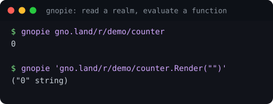
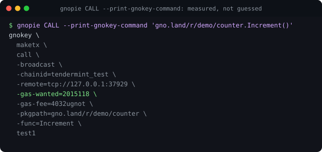
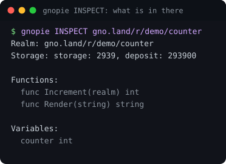
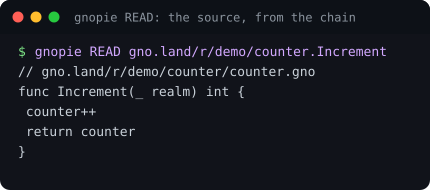
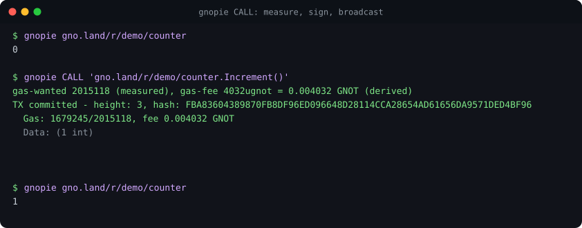

<p align="center">
  
</p>

<h1 align="center">🥧 gnopie</h1>

<p align="center">
  <b>httpie, but for <a href="https://gno.land">gno.land</a>.</b><br>
  One command to read a realm, evaluate a function, or send a transaction,<br>
  with the network discovered and <b>the gas measured instead of guessed</b>.
</p>

<p align="center">
  <a href="https://github.com/moul/gnopie/actions/workflows/ci.yml"></a>
  <a href="https://github.com/moul/gnopie/releases/latest"></a>
  <a href="./LICENSE.md"></a>
  <a href="./SECURITY.md"></a>
</p>

```bash
gnopie gno.land/r/gnoland/blog                       # render a realm
gnopie 'gno.land/r/gnoland/blog.Render("")'          # evaluate a function
gnopie READ gno.land/r/gnoland/blog.ModAddPost       # read one function's source
gnopie INSPECT gno.land/r/gov/dao                    # files and functions
gnopie CALL 'gno.land/r/gnoland/wugnot.Withdraw(102639)'
```

<p align="center"></p>

---

## ⚠️ Read this before you point it at a chain

> ### THIS IS UNAUDITED, PERSONAL, EXPERIMENTAL TOOLING.
>
> - **Not audited.** Not by anyone, ever. No security review, no third party, no
>   formal anything. Most of it was written with AI assistance.
> - **It signs and broadcasts real transactions with real money.** `CALL` and `RUN`
>   are irreversible. There is no undo on a chain.
> - **It is not a gno.land project.** Not endorsed by, affiliated with, or supported
>   by gno.land, the Gno core team, or any organisation. It is one person's tool.
> - **No stability promise.** Flags, output and behaviour change without notice or a
>   changelog. Nothing here is a supported interface.
> - **It is pinned to one gno version** and has already broken once when the VM moved
>   underneath it (see [Version pinning](#version-pinning)). A newer chain can make it
>   silently wrong, not merely broken.
> - **Read what it is about to do.** `--dry-run` and `-print` exist so you never
>   have to take its word for a transaction. Use them.
>
> **Do not use it for anything you cannot afford to lose.** If you want a supported
> tool, use [`gnokey`](https://github.com/gnolang/gno/tree/master/gno.land/cmd/gnokey).

---

## Why it exists

Composing a `gnokey maketx` by hand means knowing the RPC endpoint, the chain ID,
the function signature, the argument types, and the gas. Four of those five you
can look up. **The gas you cannot**, because gno prices a transaction on what the
code does: the same `send` costs 1,238,665 when it has to create the recipient's
account and a fraction of that when the account already exists, and nothing in
the command says which case you are in.

So people guess, and the guess is wrong:

```
gas used (11674483) exceeds tx's gas wanted (2000000)
```

gnopie simulates first and broadcasts with the measured number. There is no gas
flag to get wrong.

### And the fee, which is the half everyone misses

The fee is **not** a flat amount you pick. The ante handler compares a *ratio*:

```
gas_fee / gas_wanted  >=  block gas price
```

Two things follow, and they pull in opposite directions:

- A flat fee **bounces** as the transaction gets bigger, because `gas_wanted`
  grows with what the code does and the fee does not.
- A flat fee big enough never to bounce is **money burned**. Unlike `gas_wanted`,
  which is a ceiling and is refunded, the fee is transferred in full and never
  returned.

gnopie used to default to `-gas-fee=1000000ugnot`, a flat 1 GNOT. A measured
`counter.Increment()` needs **4,032 ugnot**. That default was overpaying by 248x,
on every transaction, while still being one big call away from bouncing.

Now both numbers are derived from the same measurement:

<p align="center"></p>

## Install

```sh
go install github.com/moul/gnopie@latest
```

or take a binary, on a machine with no Go at all:

```sh
curl -sSfL https://github.com/moul/gnopie/releases/latest/download/gnopie_linux_x86_64.tar.gz \
  | tar -xz gnopie && sudo mv gnopie /usr/local/bin/
```

Then:

```sh
gnopie config set key=<your gnokey key name>
```

Go 1.25.9 or newer. gnopie reads the gnokey keybase at `$GNOHOME`; it never
creates or stores keys of its own.

## Verbs

Inspired by httpie: the verb says what kind of thing you are doing, and the
default one is usually right.

| Verb | What it does |
|---|---|
| **GET** (default) | `Render` for a realm, `EVAL` for a call expression, `READ` for a symbol, `INSPECT` for a domain |
| **EVAL** | evaluate a read-only function call |
| **READ** | source of a function, a file, or the value of a variable |
| **INSPECT** | a network, a realm, or a symbol, in detail |
| **CALL** | sign and broadcast a `MsgCall` |
| **RUN** | generate a script and broadcast a `MsgRun` |

<p align="center"></p>

## What it does for you

- **Auto-discovery.** Reads `<meta name="gnoconnect:rpc">` off the domain's
  gnoweb page. No endpoint to configure, no chain ID to remember.
- **Auto-gas, and auto-fee.** `CALL` and `RUN` simulate, then broadcast with the
  measured gas plus a buffer, and a fee sized from that gas. This is the feature
  the whole tool is worth having for.
- **Crossing functions.** `cross(cur)` is injected for realm functions that need
  it, detected from the signature rather than assumed.
- **gnoweb URLs.** Paste `https://gno.land/r/gnoland/blog:p/beta-mainnet`
  straight in; the scheme, the render path, `$source`, `$help` and `#fragments`
  are all understood.
- **Caching.** Discovery for 24h, source and signature queries for 1h, under
  `$GNOHOME/gnopie/cache/`. State reads (eval, render, storage) are never cached.

<p align="center"></p>

## Seeing before signing

```bash
gnopie CALL --dry-run 'gno.land/r/demo/counter.Increment()'
gnopie CALL -print    'gno.land/r/demo/counter.Increment()'   # the gnokey equivalent
gnopie --json gno.land/r/gnoland/blog | jq .result
gnopie --debug gno.land/r/gnoland/blog
```

`-print` (long form `--print-gnokey-command`) is the one to reach for when you do
not trust it: it prints the `gnokey` invocation, measured gas and derived fee and
all, and broadcasts nothing.

**It will never print a number it did not measure.** It used to print a hardcoded
`10000000` on both paths, which is the one thing this tool exists to stop: the
same call measured 11,732,203 against mainnet, so a command copied out of gnopie
failed exactly the way a hand-written one does. Measuring needs a signature, so it
needs a key; without one **both gas flags are left out** and the reason is printed
beside them, rather than a plausible number being invented to fill the gap.

<p align="center"></p>

## Configuration

`$GNOHOME/gnopie/config.toml`, managed with `gnopie config`:

| Key | Default | What it does |
|---|---|---|
| `key` | none | the gnokey key that signs |
| `gas-buffer` | `20` | percent added to the measured gas. Free: the ceiling is refunded |
| `fee-margin` | `200` | percent **of the ante handler's floor**. Not free: the fee is spent |

```sh
gnopie config list
gnopie config set fee-margin=1000    # ten times the floor, for a fee you never think about
```

## Version pinning

gnopie links gno as a **library**, so it is pinned to one version in `go.mod` and
the chain it talks to may be newer. `gnopie version` prints both.

This is not hypothetical. The MsgRun generator emitted `func main()` and a bare
`cross`, which was correct when it was written and stopped type-checking when the
VM moved to `func main(cur realm)` and `cross(cur)`. The symptom was
`invalid gno package; type check failed`, which names neither the version nor the
line. `preprocess.go` is where the current rules are written down, and they are
worth reading before blaming your own code.

**When gno cuts a release, bump the pin and run the suite.** That is the
maintenance this tool costs, and
[CONTRIBUTING.md](./CONTRIBUTING.md#bumping-the-gno-pin) has the four commands.

## Testing

```sh
make test-unit    # no chain, no GNOROOT, under a second
make all          # lint + the full suite
make gnoroot      # prints how to get a gno checkout at the pinned tag
```

54 test functions, 278 assertions. Around 160 of them are pure (path parsing, fee
arithmetic, config, the generated script) and need nothing on disk. The rest boot
an in-memory gno node; without a matching gno source tree they **skip** rather
than fail.

Every image in this README is generated by `make screenshots` from real command
output against a throwaway chain, and CI fails if a committed one has gone stale.

## Contributing

[CONTRIBUTING.md](./CONTRIBUTING.md). Short version: `make test-unit` in a loop,
`make all` before you claim done, and never print a number the chain was not
asked for.

## History

Started as [gnolang/gno#5444](https://github.com/gnolang/gno/pull/5444), a draft
against `contribs/`, opened 2026-04-07 and stale since, never reviewed. Extracted
so it can move at its own pace rather than waiting on a monorepo review.

## Licence

[GNO Network General Public License](./LICENSE.md), inherited rather than chosen:
gnopie is a derivative of gno and links it as a library.
[COPYRIGHT.md](./COPYRIGHT.md) explains what that means for you, including the
Affero clause. No support, no warranty, no promises.
